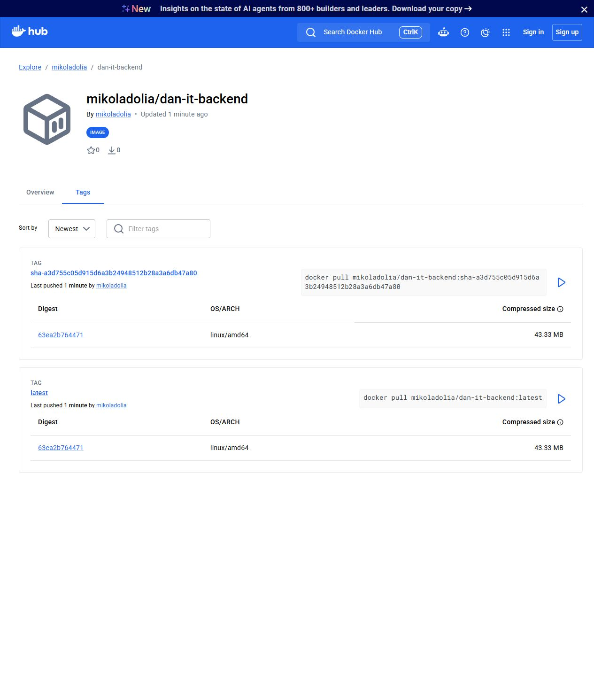
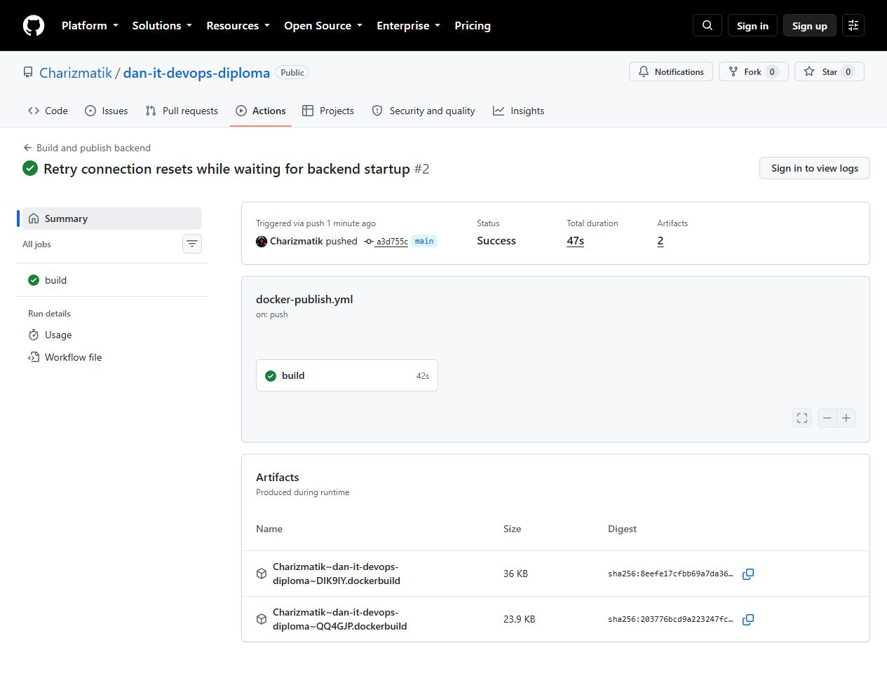
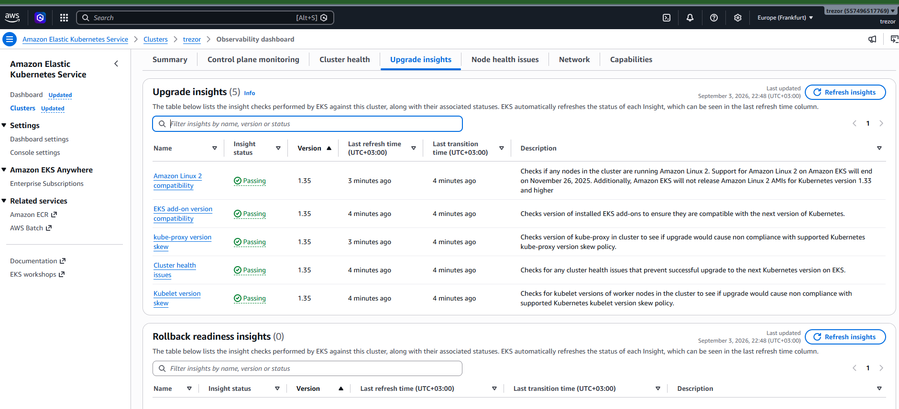
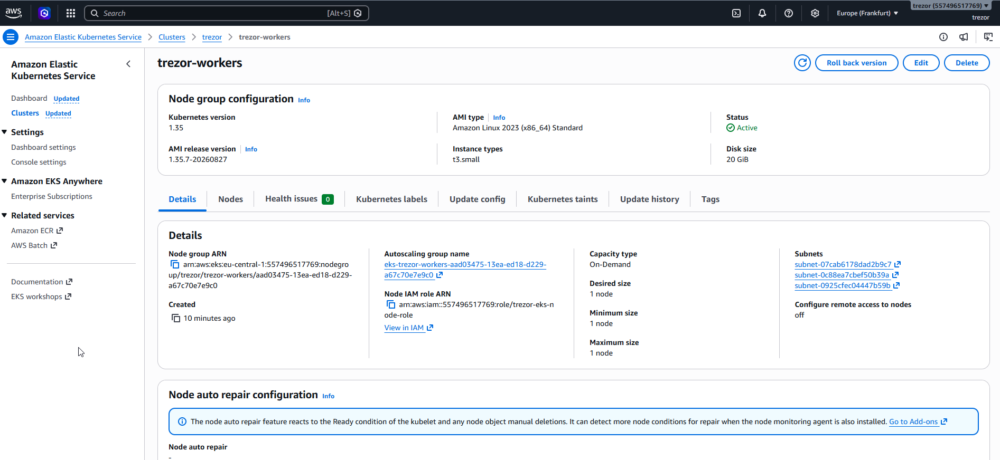
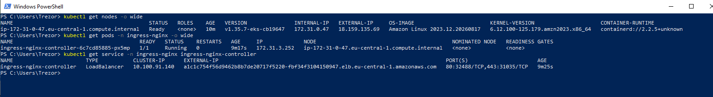
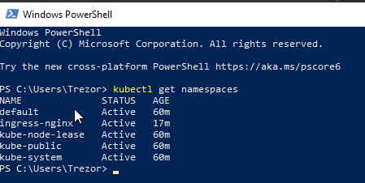
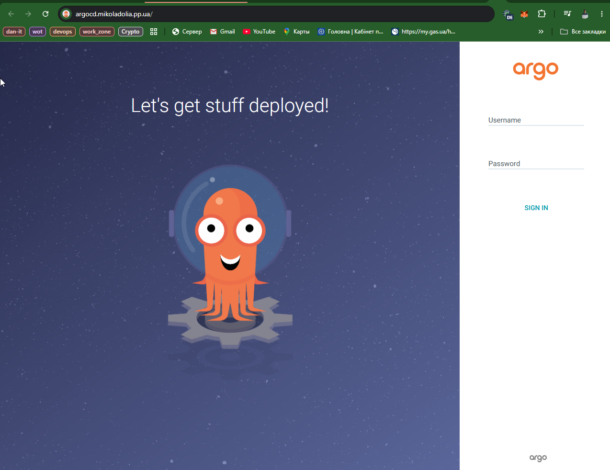

# Дипломна робота DevOps

## Вихідні дані

- Група: DevOps 13
- GitHub: [Charizmatik/dan-it-devops-diploma](https://github.com/Charizmatik/dan-it-devops-diploma)
- Docker Hub: [mikoladolia/dan-it-backend](https://hub.docker.com/r/mikoladolia/dan-it-backend/tags)
- EKS-кластер: `trezor`, AWS `eu-central-1`
- Застосунок: [http://app.mikoladolia.pp.ua](http://app.mikoladolia.pp.ua)
- ArgoCD: [http://argocd.mikoladolia.pp.ua](http://argocd.mikoladolia.pp.ua)

## 1. Код Python backend

Файл [`backend/app.py`](backend/app.py) реалізує HTTP-сервер без зовнішніх
залежностей. `/` повертає dashboard, `/api/status` — JSON з IP pod,
`/healthz` — статус для Kubernetes probes.

```python
def get_ip_address():
    if os.environ.get("POD_IP"):
        return os.environ["POD_IP"]
    try:
        return socket.gethostbyname(socket.gethostname())
    except socket.gaierror:
        return "unknown"


def status_payload():
    version = os.environ.get("APP_VERSION", "development")
    release = version.removeprefix("sha-")[:8] if version != "development" else version
    return {
        "status": "ok",
        "service": "dan-it-backend",
        "ip": get_ip_address(),
        "environment": "AWS EKS" if os.environ.get("POD_IP") else "local",
        "release": release,
        "uptime_seconds": round(time.monotonic() - STARTED_AT),
        "server_time": datetime.now(timezone.utc).isoformat(timespec="seconds"),
        "runtime": f"Python {sys.version_info.major}.{sys.version_info.minor}",
    }


class RequestHandler(BaseHTTPRequestHandler):
    def do_GET(self):
        path = urlsplit(self.path).path
        if path in ("/", "/index.html"):
            self._send_file(STATIC_DIR / "index.html", "text/html; charset=utf-8")
        elif path == "/api/status":
            self._send_json(200, status_payload())
        elif path == "/healthz":
            self._send_json(200, {"status": "ok"})
        else:
            self._send_json(404, {"error": "Not found"})
```

Локально перевірено HTTP 200, HTTP 404 та повернення IP:
[протокол backend](evidence/01-backend-local.md).

## 2. Dockerfile і Docker Hub

Файл [`Dockerfile`](Dockerfile):

```dockerfile
FROM python:3.12-slim-bookworm

ENV PYTHONDONTWRITEBYTECODE=1 \
    PYTHONUNBUFFERED=1 \
    PORT=8000

WORKDIR /app

COPY backend/app.py ./app.py
COPY backend/static/ ./static/

USER 10001:10001

EXPOSE 8000

CMD ["python", "app.py"]
```

Контейнер перевірено локально: HTTP 200, правильний IP контейнера та запуск із
UID `10001`. [Протокол Docker](evidence/02-docker-local.md).



## 3. GitHub Actions

Workflow розташовано в корені репозиторію:
[`../.github/workflows/docker-publish.yml`](../.github/workflows/docker-publish.yml).
Він збирає образ, запускає smoke test, перевіряє UID контейнера й публікує
теги `latest` та `sha-<git-sha>` в Docker Hub.

Облікові дані не зберігаються в Git. Використовуються GitHub Secrets:
`DOCKERHUB_USERNAME` і `DOCKERHUB_TOKEN`.

```yaml
- name: Log in to Docker Hub
  uses: docker/login-action@dbcb813823bdd20940b903addbd779551569679f
  with:
    username: ${{ secrets.DOCKERHUB_USERNAME }}
    password: ${{ secrets.DOCKERHUB_TOKEN }}

- name: Publish image
  uses: docker/build-push-action@53b7df96c91f9c12dcc8a07bcb9ccacbed38856a
  with:
    context: ./final-submission
    file: ./final-submission/Dockerfile
    platforms: linux/amd64
    push: true
    tags: |
      mikoladolia/dan-it-backend:latest
      mikoladolia/dan-it-backend:sha-${{ github.sha }}
```

Успішний запуск:
[GitHub Actions run 33973964536](https://github.com/Charizmatik/dan-it-devops-diploma/actions/runs/33973964536).



## 4. Terraform: EKS і одна node group

Terraform-код розташовано в [`terraform/eks/`](terraform/eks/). Він створює
EKS `1.35`, одну managed node group з одним `t3.small` node та використовує
наявну VPC і subnet IDs, передані через variables.

Фрагмент [`terraform/eks/eks.tf`](terraform/eks/eks.tf):

```hcl
resource "aws_eks_node_group" "this" {
  cluster_name    = aws_eks_cluster.this.name
  node_group_name = "${var.cluster_name}-workers"
  node_role_arn   = aws_iam_role.eks_node.arn
  subnet_ids      = var.subnet_ids
  version         = var.kubernetes_version

  ami_type       = "AL2023_x86_64_STANDARD"
  capacity_type  = "ON_DEMAND"
  disk_size      = 20
  instance_types = var.node_instance_types

  scaling_config {
    desired_size = 1
    min_size     = 1
    max_size     = 1
  }
}
```





## 5. nginx ingress controller

Файл [`terraform/eks/ingress-nginx.tf`](terraform/eks/ingress-nginx.tf)
встановлює офіційний Helm chart `ingress-nginx` версії `4.15.1`, один
controller replica й публічний AWS Network Load Balancer.

```hcl
resource "helm_release" "ingress_nginx" {
  name             = "ingress-nginx"
  repository       = "https://kubernetes.github.io/ingress-nginx"
  chart            = "ingress-nginx"
  version          = var.ingress_nginx_chart_version
  namespace        = "ingress-nginx"
  create_namespace = true

  set {
    name  = "controller.replicaCount"
    value = "1"
  }

  set {
    name  = "controller.service.annotations.service\\.beta\\.kubernetes\\.io/aws-load-balancer-type"
    value = "nlb"
  }
}
```





## 6. ArgoCD через Terraform і DNS

Файл [`terraform/eks/argocd.tf`](terraform/eks/argocd.tf) встановлює
офіційний Helm chart `argo-cd` версії `10.4.0` у namespace `argocd`.
Конфігурація оптимізована для одного `t3.small` node.

```hcl
resource "helm_release" "argocd" {
  name             = "argocd"
  repository       = "https://argoproj.github.io/argo-helm"
  chart            = "argo-cd"
  version          = var.argocd_chart_version
  namespace        = "argocd"
  create_namespace = true

  values = [yamlencode({
    global = { domain = var.argocd_hostname }
    dex = { enabled = false }
    notifications = { enabled = false }
    applicationSet = { replicas = 0 }
    configs = { params = { "server.insecure" = true } }
    server = {
      ingress = {
        enabled          = true
        ingressClassName = "nginx"
        hostname         = var.argocd_hostname
      }
    }
  })]
}
```

У NIC.UA створено CNAME `argocd.mikoladolia.pp.ua` на NLB ingress-nginx.
[Протокол ArgoCD](evidence/10-argocd-live.md) ·
[документація DNS](DOMAIN.md).



## 7. Kubernetes manifests застосунку

Маніфести розташовано в [`k8s/`](k8s/): Namespace, Deployment, Service,
Ingress і Kustomization.

```yaml
apiVersion: apps/v1
kind: Deployment
metadata:
  name: dan-it-backend
  namespace: dan-it-backend
spec:
  replicas: 1
  selector:
    matchLabels:
      app.kubernetes.io/name: dan-it-backend
  template:
    metadata:
      annotations:
        gitops.dan-it.dev/deployed-by: argocd
      labels:
        app.kubernetes.io/name: dan-it-backend
    spec:
      securityContext:
        seccompProfile:
          type: RuntimeDefault
      containers:
        - name: backend
          image: mikoladolia/dan-it-backend:sha-359aa5ae88ed778544c152b34f4a85a2827b1292
          ports:
            - name: http
              containerPort: 8000
          env:
            - name: POD_IP
              valueFrom:
                fieldRef:
                  fieldPath: status.podIP
          readinessProbe:
            httpGet:
              path: /healthz
              port: http
          livenessProbe:
            httpGet:
              path: /healthz
              port: http
          securityContext:
            allowPrivilegeEscalation: false
            capabilities:
              drop: ["ALL"]
            readOnlyRootFilesystem: true
            runAsNonRoot: true
            runAsUser: 10001
---
apiVersion: v1
kind: Service
metadata:
  name: dan-it-backend
  namespace: dan-it-backend
spec:
  type: ClusterIP
  selector:
    app.kubernetes.io/name: dan-it-backend
  ports:
    - name: http
      port: 80
      targetPort: http
---
apiVersion: networking.k8s.io/v1
kind: Ingress
metadata:
  name: dan-it-backend
  namespace: dan-it-backend
spec:
  ingressClassName: nginx
  rules:
    - host: app.mikoladolia.pp.ua
      http:
        paths:
          - path: /
            pathType: Prefix
            backend:
              service:
                name: dan-it-backend
                port:
                  name: http
```

Публічний DNS повертає застосунок через NLB, `/healthz` відповідає HTTP 200,
а `/api/status` повертає IP поточного pod.
[Протокол Kubernetes](evidence/12-kubernetes-app-live.md).


## 8. ArgoCD Application і автоматичне оновлення

Файл [`argocd/application.yaml`](argocd/application.yaml):

```yaml
apiVersion: argoproj.io/v1alpha1
kind: Application
metadata:
  name: dan-it-backend
  namespace: argocd
  finalizers:
    - resources-finalizer.argocd.argoproj.io
spec:
  project: default
  source:
    repoURL: https://github.com/Charizmatik/dan-it-devops-diploma.git
    targetRevision: main
    path: final-submission/k8s
  destination:
    server: https://kubernetes.default.svc
    namespace: dan-it-backend
  syncPolicy:
    automated:
      enabled: true
      prune: true
      selfHeal: true
    syncOptions:
      - CreateNamespace=true
      - PrunePropagationPolicy=foreground
      - PruneLast=true
```

Auto-sync перевірено фактичним комітом
[`c8e8e54`](https://github.com/Charizmatik/dan-it-devops-diploma/commit/c8e8e54fe796c43a573a8185707c71151eac2c32).
Після `git push` ArgoCD сам виявив нову ревізію, створив ReplicaSet, виконав
rollout і повернувся до стану `Synced / Healthy`.

```text
Synced|Healthy|c8e8e54fe796c43a573a8185707c71151eac2c32|Succeeded
deployment "dan-it-backend" successfully rolled out
pod/dan-it-backend-68b56bdcbd-ktjmd   1/1   Running
```

[Повний протокол GitOps auto-sync](evidence/15-argocd-gitops-live.md).

Цей дослід змінював annotation маніфесту, а не backend. Після зауважень
07.09.2026 локально додано job `update-gitops`: після публікації образу він
комітить новий SHA-тег і `APP_VERSION` у Deployment. Запуск цього виправлення
в GitHub та наскрізний rollout поки не підтверджені. Також потрібно додати
скріншоти Application, налаштувань, історії sync та актуальних namespace.
[Порядок перевірки](GITOPS-VERIFICATION.md).

## 9. Підсумок

- Python backend і Docker-образ підготовлено та перевірено.
- GitHub Actions автоматично публікує immutable SHA-теги в Docker Hub.
- Terraform створив EKS з однією node group та одним node.
- ingress-nginx і ArgoCD встановлено Helm через Terraform.
- Deployment, Service та Ingress працюють у EKS.
- Власні DNS-імена застосунку й ArgoCD доступні публічно.
- ArgoCD автоматично доставляє зміни з Git і виправляє drift.
- Секрети, Terraform state і kubeconfig до репозиторію не включено.

Розширені інструкції з відтворення та видалення ресурсів:
[`README.md`](README.md), [`EKS.md`](EKS.md), [`ARGOCD.md`](ARGOCD.md),
[`KUBERNETES.md`](KUBERNETES.md), [`CI.md`](CI.md).
