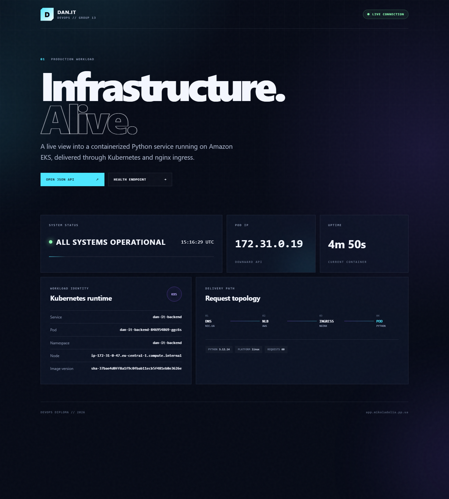

# Live DevOps dashboard

Дата перевірки: 5 вересня 2026 року.

Commit `37bae4d0ff8a1f9c0fbab11ecb5f481eb8e3626e` додав адаптивний dashboard,
JSON API та окремий Kubernetes health endpoint.

[GitHub Actions run 33973964536](https://github.com/Charizmatik/dan-it-devops-diploma/actions/runs/33973964536)
завершився зі статусом `success`. Усі кроки, включно зі збіркою тестового
образу, smoke test, входом у Docker Hub і публікацією, завершилися успішно.

Опублікований і розгорнутий immutable образ:

```text
mikoladolia/dan-it-backend:sha-37bae4d0ff8a1f9c0fbab11ecb5f481eb8e3626e
```

Rolling update в EKS завершився успішно. Новий pod:

```text
dan-it-backend-846954869-ggc6s   1/1   Running   0   172.31.0.19
```

Фактична зовнішня перевірка `http://app.mikoladolia.pp.ua`:

```text
Dashboard /        HTTP 200   text/html; charset=utf-8
CSS asset          HTTP 200
JavaScript asset   HTTP 200
/healthz           HTTP 200   status=ok
/api/status        HTTP 200   status=ok
```

API повернув:

```json
{
  "status": "ok",
  "ip": "172.31.0.19",
  "pod": "dan-it-backend-846954869-ggc6s",
  "namespace": "dan-it-backend",
  "version": "sha-37bae4d0ff8a1f9c0fbab11ecb5f481eb8e3626e",
  "python": "3.12.14"
}
```

IP із API відповідає новому pod. Dashboard автоматично оновлює телеметрію
кожні 5 секунд і не завантажує зовнішні JavaScript/CSS залежності.

## Скріншот

Скріншот зроблено безпосередньо з живого URL у Chrome після завершення rollout:


